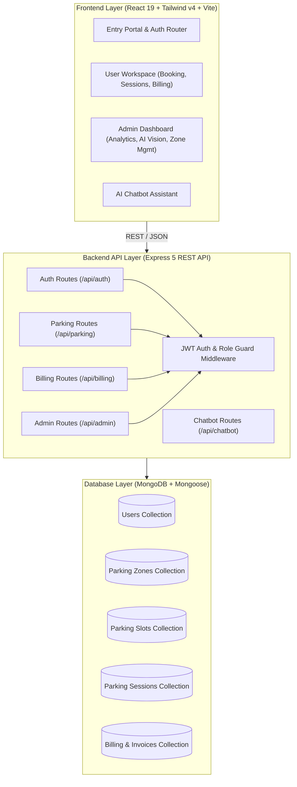

# 🅿️ ParkOS — Next-Gen Smart Parking Orchestration System

[](https://nodejs.org/)
[](https://expressjs.com/)
[](https://react.dev/)
[](https://tailwindcss.com/)
[](https://www.mongodb.com/)
[](LICENSE)

**ParkOS** is a full-stack, intelligent parking management and orchestration platform designed to streamline urban parking for consumers and operators. It features real-time slot allocation, interactive visual parking grids, automated session billing, AI Computer Vision simulation, analytics dashboards, and an integrated smart assistant.

---

## 📑 Table of Contents

- [Key Features](#-key-features)
  - [👤 User Portal](#-user-portal)
  - [🛡️ Admin Command Center](#️-admin-command-center)
  - [🤖 AI Chatbot Assistant](#-ai-chatbot-assistant)
- [System Architecture](#-system-architecture)
- [Tech Stack](#-tech-stack)
- [Project Directory Structure](#-project-directory-structure)
- [Getting Started](#-getting-started)
  - [Prerequisites](#prerequisites)
  - [1. Backend Setup](#1-backend-setup)
  - [2. Frontend Setup](#2-frontend-setup)
- [Database Seeding](#-database-seeding)
- [API Reference](#-api-reference)
  - [Authentication](#authentication-apiauth)
  - [Parking & Sessions](#parking--sessions-apiparking)
  - [Billing & Payments](#billing--payments-apibilling)
  - [Admin & Analytics](#admin--analytics-apiadmin)
  - [Chatbot](#chatbot-apichatbot)
- [Environment Variables](#-environment-variables)
- [License](#-license)

---

## ✨ Key Features

### 👤 User Portal
- **Interactive Zone & Slot Explorer**: Real-time visualization of slots categorized by status (`available`, `occupied`, `reserved`).
- **Slot Reservation & Allocation**: Book specific slots dynamically with temporary reservation locks.
- **Session Lifecycle Tracker**: Live session management with real-time timer (Start, Monitor, End Session).
- **Flexible Billing & Mock Payments**: Automated hourly calculation with multi-gateway mock checkout (Paytm, PhonePe, Credit Card, Cash) and retry options for failed payments.
- **Parking & Billing History**: Detailed breakdown of past sessions, invoices, and payment receipts.

### 🛡️ Admin Command Center
- **Executive Analytics Dashboard**:
  - Live KPIs: Total users, registered zones, total slot capacity, cumulative revenue, and active vehicle counts.
  - **7-day Occupancy Trends** area charts.
  - **Zone Revenue Distribution** interactive pie charts via Recharts.
- **Infrastructure Management**:
  - Add/delete parking zones with cascading slot cleanups.
  - Dynamically provision and number parking slots for each zone.
- **Active Session Management**: View all ongoing vehicle parking sessions across all zones and manually end sessions if needed.
- **AI Computer Vision Simulation**:
  - Live HUD camera simulation (`ParkNet-v4.0_Pro`).
  - Automated or manual vehicle entry & exit event triggers.
  - Real-time detection logging with automatic slot assignment and bill generation.
- **Financial Audits & Data Export**: Complete transaction audit logs with one-click **CSV report generation** (`/api/billing/export/csv`).

### 🤖 AI Chatbot Assistant
- Persistent floating assistant available across the application.
- Rule-based natural language processing for instant guidance on booking, session handling, troubleshooting payment failures, and zone finding.

---

## 🏗️ System Architecture



---

## 🛠️ Tech Stack

### Backend
- **Runtime**: Node.js
- **Framework**: Express.js (v5.x)
- **Database**: MongoDB with Mongoose ODM (v9.x)
- **Authentication**: JSON Web Tokens (JWT) & bcryptjs password hashing
- **Data Export**: `json2csv` for administrative CSV exports
- **CORS & Environment**: `cors`, `dotenv`

### Frontend
- **Framework**: React 19 with Vite
- **Styling**: Tailwind CSS v4, Lucide React icons
- **Data Visualization**: Recharts (Area charts, Pie charts)
- **Routing**: React Router DOM (v7.x)
- **HTTP Client**: Axios

---

## 📂 Project Directory Structure

```text
Park-Os/
├── backend/
│   ├── middleware/
│   │   └── authMiddleware.js      # JWT token verification & admin guards
│   ├── models/
│   │   ├── Billing.js             # Billing and payment records schema
│   │   ├── ParkingSession.js      # Active & past parking sessions schema
│   │   ├── ParkingSlot.js         # Slot numbers, status & zone relations
│   │   ├── ParkingZone.js         # Zone names & physical locations schema
│   │   └── User.js                # User accounts & role schema (user/admin)
│   ├── routes/
│   │   ├── adminRoutes.js         # Admin endpoints, analytics & AI simulation
│   │   ├── authRoutes.js          # Registration, login & authentication
│   │   ├── billingRoutes.js       # Payment processing & CSV export
│   │   ├── chatbotRoutes.js       # Assistant NLP handler
│   │   └── parkingRoutes.js       # Slot booking, session lifecycle
│   ├── package.json
│   ├── render.yaml                # Cloud deployment configuration
│   ├── seed.js                    # Database demo data seeder
│   └── server.js                  # Express server entry point & DB connection
├── frontend-user/                 # User & Admin Unified Portal
│   ├── src/
│   │   ├── components/            # Layouts, ParkingGrid, ChatbotWidget
│   │   ├── context/               # AuthContext state provider
│   │   ├── pages/                 # User & Admin dashboards, AI Camera, Sessions
│   │   ├── App.jsx                # Main routing & guards
│   │   └── main.jsx
│   ├── package.json
│   └── vite.config.js
├── fix-urls.js                    # URL normalization utility
└── README.md
```

---

## 🚀 Getting Started

### Prerequisites
- [Node.js](https://nodejs.org/) (v18.0.0 or higher)
- [MongoDB](https://www.mongodb.com/) running locally or a MongoDB Atlas connection URI
- `npm` or `yarn`

---

### 1. Backend Setup

1. **Navigate to the backend folder**:
   ```bash
   cd backend
   ```

2. **Install dependencies**:
   ```bash
   npm install
   ```

3. **Configure Environment Variables**:
   Create a `.env` file in the `backend/` root directory:
   ```env
   PORT=5000
   MONGO_URI=mongodb://127.0.0.1:27017/parkos
   JWT_SECRET=your_jwt_secret_key_here
   ```

4. **Seed the database (Optional but Recommended)**:
   Populate initial zones and parking slots:
   ```bash
   npm run seed
   # or
   node seed.js
   ```

5. **Start the server**:
   ```bash
   node server.js
   ```
   *The server will start on `http://localhost:5000`.*

---

### 2. Frontend Setup

1. **Navigate to the frontend directory**:
   ```bash
   cd ../frontend-user
   ```

2. **Install dependencies**:
   ```bash
   npm install
   ```

3. **Configure Frontend Environment**:
   Create a `.env` file in `frontend-user/`:
   ```env
   VITE_API_URL=http://localhost:5000
   ```

4. **Run the Development Server**:
   ```bash
   npm run dev
   ```
   *Access the web application at `http://localhost:5173`.*

---

## 🌱 Database Seeding

The `seed.js` script initializes the database with default zones and slots for instant testing:
- **VIP Plaza** (`VIP-01` to `VIP-10`) — North Gate
- **Economy Block** (`ECO-001` to `ECO-020`) — South Wing
- **Faculty & Staff** (`FAC-01` to `FAC-15`) — East Wing

To run the seeder:
```bash
node backend/seed.js
```

> **Note**: The first registered user in the database is automatically assigned the `admin` role. Subsequent registrations default to `user`.

---

## 📡 API Reference

### Authentication (`/api/auth`)
| Method | Endpoint | Access | Description |
|---|---|---|---|
| `POST` | `/register` | Public | Register new user account (1st user = admin) |
| `POST` | `/login` | Public | Authenticate credentials & return JWT |
| `POST` | `/logout` | Public | User logout signal |

### Parking & Sessions (`/api/parking`)
| Method | Endpoint | Access | Description |
|---|---|---|---|
| `GET` | `/zones` | Private | Retrieve all parking zones |
| `GET` | `/slots/:zoneId` | Private | Retrieve all slots in a specific zone |
| `POST` | `/book` | Private | Temporarily reserve an available slot |
| `POST` | `/session/start` | Private | Start an active parking session |
| `POST` | `/session/end` | Private | End active session and calculate bill |
| `GET` | `/session/history` | Private | Fetch logged-in user's session history |

### Billing & Payments (`/api/billing`)
| Method | Endpoint | Access | Description |
|---|---|---|---|
| `POST` | `/pay` | Private | Process mock payment (Paytm / PhonePe / Card) |
| `GET` | `/history` | Private | View user's billing and payment history |
| `GET` | `/export/csv` | Admin | Export all billing and revenue records as CSV |

### Admin & Analytics (`/api/admin`)
| Method | Endpoint | Access | Description |
|---|---|---|---|
| `GET` | `/users` | Admin | Retrieve all registered users |
| `POST` | `/zone` | Admin | Create a new parking zone |
| `DELETE` | `/zone/:id` | Admin | Remove a zone and all associated slots |
| `POST` | `/slot` | Admin | Add a slot to a zone |
| `GET` | `/billing` | Admin | Fetch all system billing transactions |
| `GET` | `/sessions/active` | Admin | List all ongoing parking sessions |
| `POST` | `/session/end` | Admin | Force checkout a session as an admin |
| `GET` | `/analytics/revenue` | Admin | Revenue aggregation grouped by zone |
| `GET` | `/analytics/occupancy` | Admin | Historical 7-day occupancy metrics |
| `POST` | `/simulate-ai-camera` | Admin | Trigger AI vision entry/exit car detection |

### Chatbot (`/api/chatbot`)
| Method | Endpoint | Access | Description |
|---|---|---|---|
| `POST` | `/` | Public | Submit message query and receive NLP response |

---

## 🔒 Security & Best Practices
- **JWT Authorization**: All private routes protected by Bearer token validation.
- **Role-Based Access Control**: Strict separation between consumer workflows and administrative command tools.
- **Password Security**: Salted hashing via `bcryptjs`.
- **CORS Protection**: Configured cross-origin resource sharing middleware.

---

## 📄 License

This project is licensed under the **ISC License**.